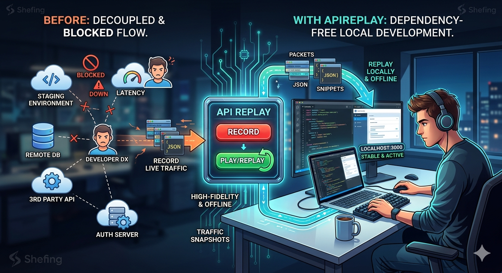
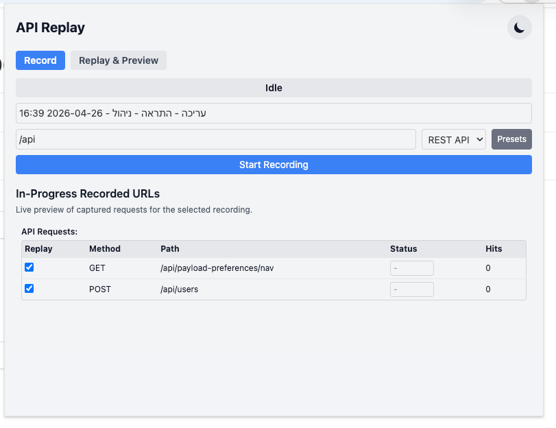

# API Replay

API Replay is a Chrome MV3 extension for recording and replaying network/API traffic so frontend work is deterministic, even when shared environments are unstable.

It is built for a low-overhead workflow: record once, export JSON fixtures, and replay locally in dev or tests without introducing extra infra.



## Why teams use it

- Keep working when central APIs are slow, down, or changing.
- Reproduce API-dependent bugs with versioned fixtures.
- Mock real client/network request flows without switching tools.
- Stay in your existing workflow (browser + editor + test runner).

## Quick start (about 5 minutes)

### 1) Download a released build

1. Download the latest `dist.zip` from GitHub Releases.
2. Unzip it locally to a folder (for example `~/Downloads/apireplay-dist/`).

### 2) Load the extension in Chrome



1. Open [chrome://extensions/](chrome://extensions/).
2. Enable `Developer mode`.
3. Click `Load unpacked`.
4. Select the unzipped release folder.

### 3) Record and replay your first flow

1. Open the extension popup.
2. Start recording with a name + URL filter.
3. Use your app normally so requests are captured.
4. Stop recording.
5. Start replay for that recording and refresh your app.

Tip: Use `Alt+Shift+R` to toggle recording quickly.

## Common workflows

### A) Record in shared environment, replay locally (with URL path mapping)

A common use case is recording on a central/staging environment where APIs are served under microservice-prefixed paths (e.g. `/microservice1/api/users`), then replaying locally where the same API is served at a shorter path (e.g. `/api/users`).

To handle this:
1. Record normally on the central environment — requests are stored as-is.
2. Before starting replay locally, enter a URL mapping in the **URL Mappings** field in the Replay tab:
   ```
   /microservice1/api -> /api
   ```
3. During replay, incoming requests to `/api/users` will be matched against the recorded `/microservice1/api/users` entry.

Multiple mappings are supported (one per line). The first matching prefix wins. Mappings are saved with the recording's replay options and restored when you select the recording again.

Capture traffic from a central/staging environment, export the recording JSON, commit it, and reuse it locally or in CI.

- Guide: [`docs/workflows/central-record-local-replay.md`](docs/workflows/central-record-local-replay.md)

### B) Reuse exported recordings in Playwright client-fetch tests

Use `applyRecordingMocks` to fulfill browser requests from an exported recording fixture:

- Guide: [`docs/playwright-integration.md`](docs/playwright-integration.md)
- Helper API: [`tests/helpers/recording-mock.ts`](tests/helpers/recording-mock.ts)

## Capability boundary

API Replay currently documents and supports client/network request mocking flows. This repository does **not** position SSR recording as a currently supported feature.

## Core capabilities

- Record requests by URL filter.
- Replay captured responses with optional fallback matching.
- Edit saved response payloads and status codes.
- Manage multiple recordings (rename, duplicate, delete, import, export).
- Use presets for common filters.
- Search requests by URL/method/status.
- Enable/disable replay per request.
- Simulate replay latency (`latencyMs` or range).
- Map recorded URL path prefixes to different prefixes during replay (e.g. `/microservice1/api` → `/api`).
- View replay stats (matched/unmatched/hit counts).

## Development commands

```bash
npm run lint
npm run typecheck
npm run test
npm run build
```

Useful scripts:

- `npm run dev` - Vite dev mode
- `npm run package` - builds and creates `dist.zip`
- `npm run test:e2e` - Playwright extension smoke test

## Architecture overview

- `src/background/`: modular MV3 service worker (`main`, `recorder`, `replayer`, `messaging`, `state-store`, `logger`)
- `src/popup/`: popup UI with components and storage/import-export services
- `src/shared/`: typed message/storage/recording contracts
- Storage model uses versioned, UUID-keyed recordings with migration support

## More docs

- [`CHANGELOG.md`](CHANGELOG.md)
- [`CONTRIBUTING.md`](CONTRIBUTING.md)
- [`SECURITY.md`](SECURITY.md)
- [`PRIVACY.md`](PRIVACY.md)
- [`docs/playwright-integration.md`](docs/playwright-integration.md)
- [`docs/workflows/central-record-local-replay.md`](docs/workflows/central-record-local-replay.md)
- [`docs/store/`](docs/store/)

## License

Apache 2.0 - see `LICENSE`.

